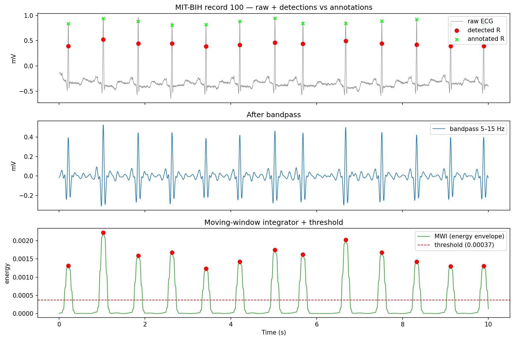
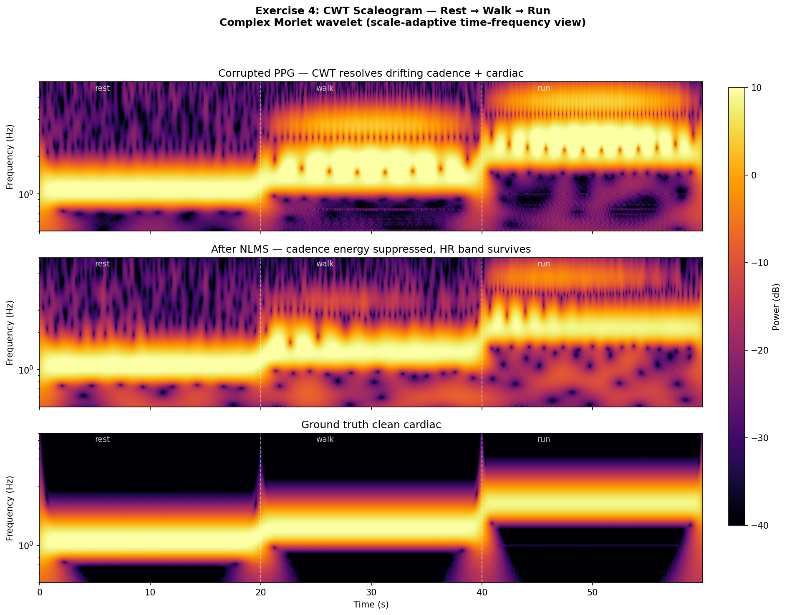

# DSP for Wearable Health Signals

> Applied digital signal processing for PPG and ECG — the same toolkit that turns a noisy wrist sensor into a heart-rate number.


A hands-on portfolio of the DSP inside every wearable health device, built from first principles and validated against synthetic ground truth or real clinical data. The work is organized by topic:

| Folder | What's inside |
|--------|---------------|
| [`filters-and-detection/`](filters-and-detection/) | Classic DSP on raw ECG/PPG — Butterworth band-pass, Pan-Tompkins QRS detection (scored on MIT-BIH), 50/60 Hz notch, and a spectrogram + NLMS adaptive motion-rejection study with a CWT scaleogram. |
| [`ppg/`](ppg/) | PPG physiology and pulse analysis — AC/DC perfusion index, heart-rate extraction (scored on PPG-DaLiA), HRV from a tachogram, and SpO₂ via ratio-of-ratios. |

Each folder has its own README with the full walkthrough and figures.

## Highlights

**Pan-Tompkins QRS detection on MIT-BIH record 100** — built from scratch, scored at Sensitivity = 1.000 and Positive Predictivity = 1.000 against cardiologist annotations.



**CWT scaleogram of a rest → walk → run PPG** — a scale-adaptive view of the same motion-corrupted signal, before and after NLMS adaptive rejection.



## Setup

Dependencies are shared across folders:

```bash
python3 -m venv .venv
source .venv/bin/activate          # Windows: .venv\Scripts\activate
pip install -r requirements.txt
```

Then `cd` into a folder and run any script — see that folder's README for details.

## License

MIT — free to use for learning and reference.
