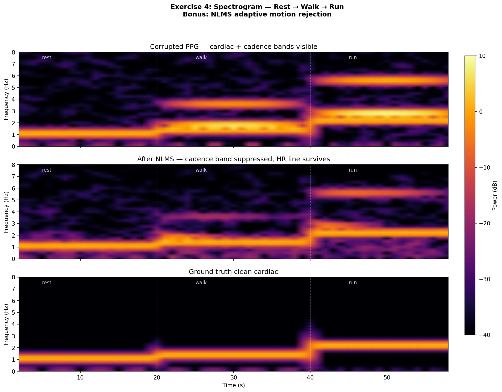
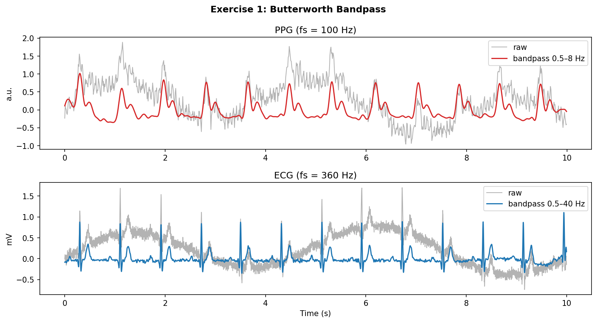
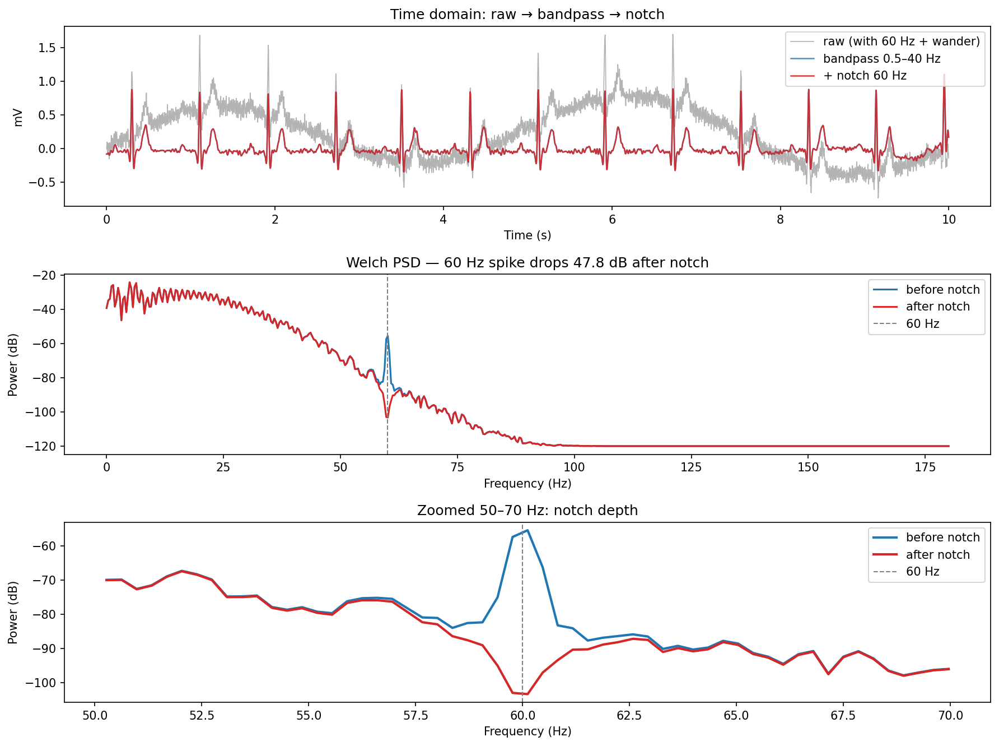
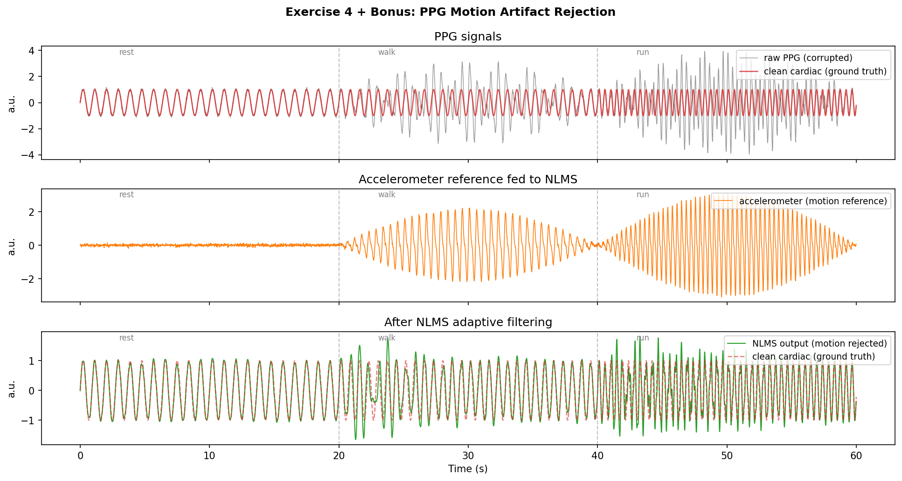

# DSP for Wearable Health Signals

> Applied digital signal processing for PPG and ECG — the same toolkit that turns a noisy wrist sensor into a heart-rate number.



*Top: a PPG recorded through a rest → walk → run transition — as intensity climbs, the foot-strike **cadence** band crowds the **cardiac** band. Middle: after a Normalized-LMS adaptive filter driven by an accelerometer reference, the cadence band is suppressed and the heart-rate line survives. Bottom: ground-truth cardiac signal.*

A compact, hands-on tour of the DSP inside every wearable health device: **filter design, beat detection, denoising, and adaptive motion rejection**. Each technique is built from first principles, validated against synthetic ground truth or real clinical data, and rendered as a figure you can read at a glance — a learning portfolio focused on *why* each method works and why it matters for real hardware.

---

## Contents

| # | Script | What it does |
|---|--------|--------------|
| 1 | [`exercise1_bandpass.py`](exercise1_bandpass.py) | Zero-phase Butterworth band-pass that strips baseline wander and HF noise from synthetic PPG and ECG. |
| 2 | [`exercise2_pan_tompkins.py`](exercise2_pan_tompkins.py) | Pan-Tompkins QRS detector built from scratch, validated against **MIT-BIH record 100** (Sensitivity + Positive Predictivity). |
| 3 | [`exercise3_notch.py`](exercise3_notch.py) | IIR notch filter that removes 50/60 Hz powerline hum, verified with a before/after Welch PSD. |
| 4 | [`exercise4_spectrogram_nlms.py`](exercise4_spectrogram_nlms.py) | Spectrogram of a rest→walk→run PPG **+ bonus** NLMS adaptive filter that removes cadence artifact using an accelerometer reference, **plus** a CWT (continuous wavelet transform) scaleogram for comparison. |

Shared synthetic-signal generators and filter helpers live in [`utils.py`](utils.py) so the algorithms aren't duplicated across scripts.

---

## How to Run

```bash
# 1. Clone
git clone https://github.com/hksuri/dsp-health-signals.git
cd dsp-health-signals

# 2. Install dependencies (a virtualenv is recommended)
python3 -m venv .venv
source .venv/bin/activate          # Windows: .venv\Scripts\activate
pip install -r requirements.txt

# 3. Run any exercise — each saves its figure(s) into figures/
python exercise1_bandpass.py
python exercise2_pan_tompkins.py   # downloads MIT-BIH record 100 from PhysioNet
python exercise3_notch.py
python exercise4_spectrogram_nlms.py
```

Every script is self-contained, prints a short console summary, and writes PNGs into `figures/`. Exercise 2 fetches MIT-BIH record 100 via `wfdb`; if the download (or `wfdb`) is unavailable, it falls back gracefully and still produces the synthetic figure.

---

## Walkthrough

### 1 — Butterworth Band-Pass Filtering



A band-pass keeps only the band where the physiology lives — discarding slow **baseline wander** (<0.5 Hz, from breathing and electrode motion) below it and **high-frequency noise** above. Applied with `sosfiltfilt`, a forward-backward pass that is **zero-phase**: no time delay, so beat timing isn't smeared. That matters most for ECG, where the relative position of the P, QRS, and T waves *is* the diagnostic information — a filter delaying frequencies unequally would distort the very morphology a clinician reads.

### 2 — Pan-Tompkins QRS Detection


Pan-Tompkins is the classic algorithm behind decades of heart-rate monitors. The pipeline makes QRS complexes unmissable: **band-pass (5–15 Hz)** to isolate QRS energy → **derivative** for the steep R-wave slope → **squaring** to amplify large slopes → **moving-window integration** for a smooth energy envelope → an **adaptive threshold** to pick peaks, back-tracked to the true R-peak. Scored against the cardiologist annotations on **MIT-BIH record 100**, it reaches **Sensitivity = 1.000** and **Positive Predictivity = 1.000** (2273 TP, 1 FP, 0 misses, ±50 ms tolerance) — annotations and detections sit right on top of each other. The synthetic run (`exercise2_pan_tompkins_synthetic.png`) is a controlled sanity check with known beat positions.

### 3 — Powerline (50/60 Hz) Notch Filter



Mains electricity radiates a narrow, persistent tone into any biopotential recording — 60 Hz in North America, 50 Hz elsewhere. A **zero-phase IIR notch** (`iirnotch` + `filtfilt`) carves out a thin slice of spectrum at exactly that frequency, leaving neighbouring ECG content untouched. The before/after **Welch PSD** makes it unambiguous: the 60 Hz spike drops **~48 dB** (−55.5 → −103.3 dB), erasing the hum without blunting the QRS. A notch beats simply low-passing below 60 Hz because real ECG carries useful energy *above* the powerline frequency.

### 4 — Spectrogram + NLMS Adaptive Motion Rejection



The spectrogram at the top is the headline result; this time-domain view shows the mechanism. During exercise the **cadence** (steps per second) drives a large motion artifact into the PPG — and crucially, cadence and heart rate occupy *overlapping*, drifting frequencies, so no fixed filter can separate them. The fix is an extra sensor: an **accelerometer** that sees the motion but not the blood flow. A **Normalized LMS (NLMS)** filter learns, sample by sample, the mapping from accelerometer to PPG motion and subtracts it; the leftover error signal is the cardiac waveform. Normalizing the step size by input power keeps it stable from a stroll to a sprint — which is why production optical heart-rate sensors rely on adaptive reference cancellation, not a smarter band-pass.

#### CWT scaleogram — a scale-adaptive view


The STFT spectrogram uses **one fixed window length** for every frequency, so its time-vs-frequency resolution trade-off is the same across the whole plot. A **continuous wavelet transform (CWT)** instead stretches and squeezes a mother wavelet — here a **complex Morlet** — so it uses short windows at high frequencies (sharp timing for the fast cadence harmonics) and long windows at low frequencies (fine resolution for the slow cardiac band). The scaleogram shows the same corrupted → NLMS → ground-truth signals as the spectrogram: the cardiac band steps up cleanly through rest → walk → run, the cadence energy and its harmonics are visible in the corrupted PPG and largely gone after NLMS. This figure is optional — it needs `PyWavelets`, and the script skips it gracefully if that package isn't installed.

---

## Notes

- **Synthetic signals** are used wherever ground truth matters, so each algorithm can be scored against a known answer rather than judged by eye.
- All figures are committed under `figures/` so they render directly on GitHub; re-running any script regenerates them.
- MIT-BIH data is © PhysioNet and is downloaded on demand — it is not redistributed in this repo.

## License

MIT — free to use for learning and reference.
