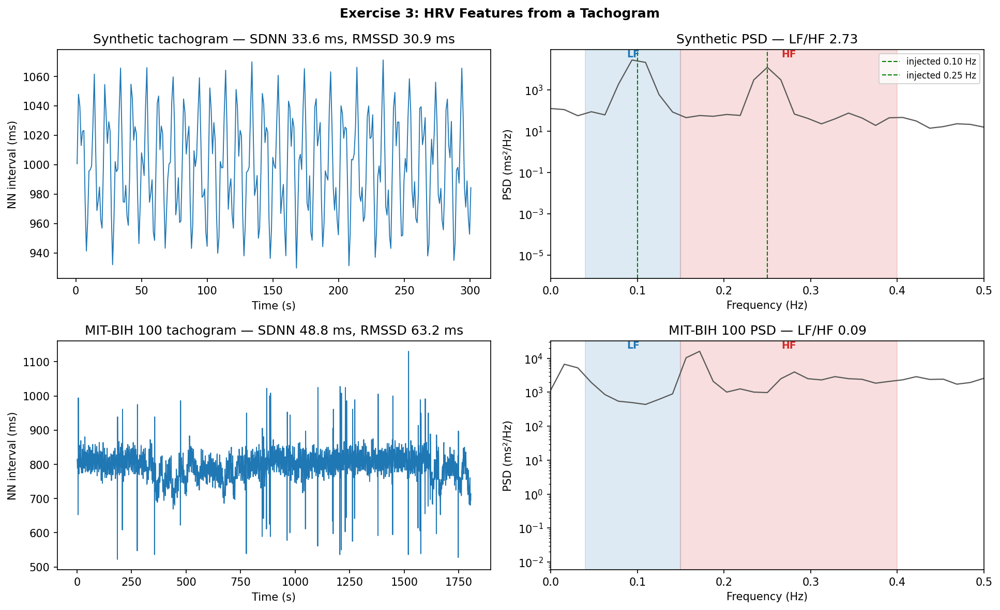
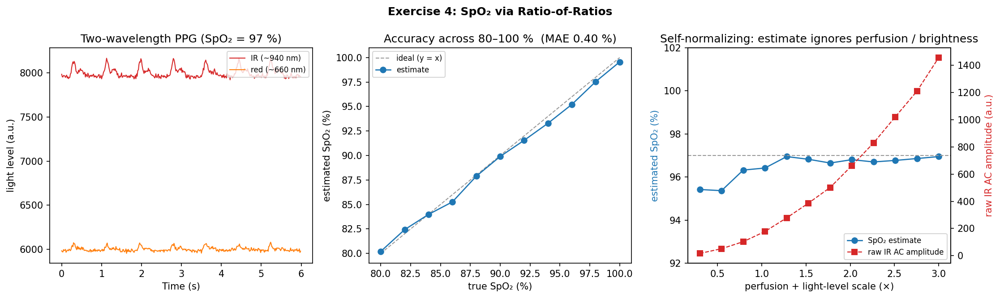

# PPG: Physiology & Pulse Analysis

> Photoplethysmography from the signal up — splitting the pulse from the
> baseline, gating bad windows, and turning a wrist PPG into a heart rate.

Part of [**DSP for Wearable Health Signals**](../README.md).

A PPG is a big, slow **DC** light level with a tiny pulsatile **AC** ripple on
top — the extra light absorbed each heartbeat. These exercises work that signal
from first principles toward a real, scored heart-rate estimate.

---

## Contents

| # | Script | What it does |
|---|--------|--------------|
| 1 | [`exercise1_ac_dc_pi.py`](exercise1_ac_dc_pi.py) | Split PPG into AC (pulse) / DC (baseline), compute the **Perfusion Index**, and gate low-quality windows below ~0.3 % — the signal-quality check a watch runs before reporting a heart rate. *(synthetic)* |
| 2 | [`exercise2_hr_pipeline.py`](exercise2_hr_pipeline.py) | Full **heart-rate-from-PPG** pipeline scored on **PPG-DaLiA**, with the error broken out **by activity** — exposing how motion wrecks a wrist HR estimate. *(real data)* |
| 3 | [`exercise3_hrv.py`](exercise3_hrv.py) | **HRV** from a tachogram — time-domain (SDNN, RMSSD, pNN50) and frequency-domain (LF/HF), with the cubic-spline resample that makes a once-per-beat series FFT-able. *(synthetic + real)* |
| 4 | [`exercise4_spo2.py`](exercise4_spo2.py) | **SpO₂** via the red/IR **ratio-of-ratios** — showing the estimate tracks true saturation and is *self-normalizing*: immune to perfusion and light-level changes. *(synthetic)* |

The synthetic-PPG generator, the PPG-DaLiA loader, and the figure helper live in
[`utils.py`](utils.py).

---

## How to Run

Dependencies are shared at the repo root — see the [top-level README](../README.md#setup).

```bash
# Exercise 1 — self-contained, runs anywhere
python exercise1_ac_dc_pi.py

# Exercise 2 — needs the real PPG-DaLiA dataset (UCI ML Repository, ~3 GB).
# Download, unzip, and point the script at the PPG_FieldStudy folder:
python exercise2_hr_pipeline.py --data-dir /path/to/PPG_FieldStudy
# or one subject:  --subject S3      (or set $PPG_DALIA_DIR)

# Exercise 3 — synthetic part runs anywhere; the real part downloads
# MIT-BIH record 100 from PhysioNet via `wfdb` (skips gracefully if offline).
python exercise3_hrv.py

# Exercise 4 — fully self-contained (synthetic red + IR PPG)
python exercise4_spo2.py
```

The ~19 GB of unpacked PPG-DaLiA pickles are **not** committed — they're external
data and live outside the repo. Exercise 3 needs `wfdb`; this machine has it in
the `ct-view` conda env (see [`CLAUDE.md`](../CLAUDE.md)).

---

## Walkthrough

### 1 — AC/DC Split + Perfusion Index


*Data: synthetic — PPG with a known sensor-liftoff drop-out (8–13 s) from `synth_ppg_quality` in [`utils.py`](utils.py), so the quality gate can be checked against a known bad region.*

Two zero-phase filters separate the signal: a heavy low-pass (< 0.4 Hz) recovers
the **DC** baseline (top), and a 0.5–8 Hz band-pass recovers the **AC** pulse
(middle). The **Perfusion Index** is the pulse size relative to the baseline,

```
PI = 100 × (p95(AC) − p5(AC)) / mean(DC)   [%]
```

— percentiles rather than min/max so a single motion spike can't inflate it.
Computed in a sliding 2 s window (bottom), PI collapses when the modelled sensor
lifts off the skin (8–13 s); windows below the **0.3 % gate** are shaded and
rejected. That gate is why a watch shows "—" instead of a confidently wrong
number: when the pulse is too weak to trust, you refuse to report.

### 2 — HR-from-PPG on PPG-DaLiA, stratified by activity


*Data: **real** — PPG-DaLiA (UCI ML Repository), all 15 subjects, wrist Empatica E4 BVP at 64 Hz; ground-truth HR derived from the chest-ECG reference. Dataset is external and not committed.*

The pipeline is the standard recipe:

```
band-pass 0.5–4 Hz → peak detection (0.3 s refractory + prominence floor)
   → inter-beat intervals → instantaneous HR → reject impossible beats → median
```

[PPG-DaLiA](https://archive.ics.uci.edu/dataset/495/ppg+dalia) records a wrist
PPG (64 Hz) alongside an ECG-derived ground-truth HR, while 15 subjects sit,
walk, cycle, climb stairs, drive, and so on. Estimates are scored on the
dataset's own **8 s / 2 s window grid** so each one aligns with a ground-truth
label, and every window is tagged with its majority activity.

The point isn't one average number — it's the **activity-stratified** error,
because that's where the story lives (all 15 subjects, 64,695 windows):

| activity | MAE (bpm) |
|----------|----------:|
| working  | 9.19 |
| driving  | 9.58 |
| lunch    | 9.72 |
| sitting  | 9.92 |
| transient| 13.68 |
| cycling  | 15.26 |
| walking  | 16.46 |
| table-soccer | 18.53 |
| **stairs** | **21.19** |
| **overall** | **12.40** |

Stationary activities sit around **9–10 bpm**; motion roughly **doubles** the
error (stairs 21, table-soccer 19, walking 16). The cause is physical: arm-swing
**cadence** lands inside the cardiac band, and the peak detector locks onto
footsteps instead of heartbeats. No peak-picking trick separates them — that
takes an accelerometer reference and adaptive cancellation, which is exactly the
next project.

### 3 — HRV Features from a Tachogram



*Data: **synthetic + real**. Top row — a synthetic tachogram (`synth_tachogram`) with LF and HF oscillations injected at **known** frequencies/amplitudes, so the spectral readout can be checked against the truth. Bottom row — **real** NN intervals from MIT-BIH record 100 (PhysioNet, via `wfdb`).*

Heart-rate *variability* is the structure in the beat-to-beat intervals (the
**tachogram**), not the average rate. Two families of features:

```
time domain   SDNN  = std(NN)                  RMSSD = √mean(ΔNN²)   pNN50 = %|ΔNN|>50ms
freq domain   LF = ∫PSD over 0.04–0.15 Hz      HF = ∫PSD over 0.15–0.40 Hz      LF/HF
```

The frequency-domain half exists to teach **one** thing: a tachogram is sampled
once per beat, so its time axis is *uneven* — an FFT is meaningless on it. You
must first **cubic-spline resample** the intervals onto a uniform grid (4 Hz
here), then take a Welch PSD. The synthetic panel is the proof it works: LF and
HF were injected at exactly **0.10 Hz** and **0.25 Hz**, and the recovered
spectrum (top-right) peaks right on those green markers, with LF/HF = 2.73 —
matching the injected amplitude ratio (40 ms vs 25 ms → (40/25)² ≈ 2.56). Only
once the math is validated on a known answer do we trust it on the **real**
MIT-BIH record 100 (bottom row), which comes out HF-dominated (LF/HF ≈ 0.09).

> Caveat shown honestly: NN intervals from real ECG need beat-by-beat **ectopic
> correction** for a clean LF/HF — here a single physiologic-range filter
> (300–2000 ms) stands in for it, so the real LF/HF is indicative, not clinical.

### 4 — SpO₂ via Ratio-of-Ratios



*Data: synthetic — two-wavelength (red + IR) PPG from `synth_ppg_red_ir`, built so the AC/DC ratio encodes a chosen SpO₂. (Raw dual-wavelength red/IR recordings aren't in any readily-available public dataset — PPG-DaLiA is single-channel, MIT-BIH is ECG — so this exercise is synthetic by necessity.)*

A pulse oximeter uses two wavelengths — **red (~660 nm)** and **infrared
(~940 nm)** — because oxy- and deoxy-haemoglobin absorb them differently. It
reads the *pulsatile* (AC) signal relative to the steady (DC) light level at
each, then takes the ratio of those ratios:

```
R = (AC_red / DC_red) / (AC_ir / DC_ir)        SpO₂ ≈ 110 − 25·R
```

The whole trick is that **R is self-normalizing**. Dividing AC by DC at each
wavelength cancels anything that scales a channel as a whole — skin tone, sensor
gain, contact pressure, how hard the finger presses. Only the oxygen-dependent
ratio survives. The right-hand panel is the proof: with SpO₂ held at 97 %, the
raw IR pulse amplitude is swept **~85×** (varying perfusion *and* brightness),
yet the estimate stays within **±0.8 %**. The middle panel confirms the estimate
tracks true saturation across 80–100 % (MAE 0.40 %).

> Honesty note: the synthetic signals are generated with the *same* 110/25
> calibration the estimator inverts, so this validates the **DSP** — that the
> ratio is robust — **not** the calibration curve. Those constants are empirical
> (fit to human cohorts), not physics; a real device needs clinical calibration
> against a CO-oximeter. That's the point worth defending in a writeup.

---

## Notes

- **Data sources** are labelled under each figure. **Exercise 1** uses a
  synthetic PPG (known perfusion drop-out); **Exercise 2** uses real PPG-DaLiA
  only; **Exercise 3** validates on a synthetic tachogram with known LF/HF, then
  runs on real MIT-BIH NN intervals; **Exercise 4** is synthetic two-wavelength
  PPG (no public raw red/IR dataset), used to demonstrate the self-normalizing
  ratio rather than to validate the empirical calibration constants.
- The 12.4 bpm overall MAE is a deliberately **naive** baseline — published
  PPG-DaLiA results reach ~7–8 bpm with frequency-domain tracking and motion
  compensation. The goal here is to expose the motion problem honestly, not to
  beat the benchmark (yet).
- The HR timeline in the figure is one subject; the MAE bars aggregate all 15.
