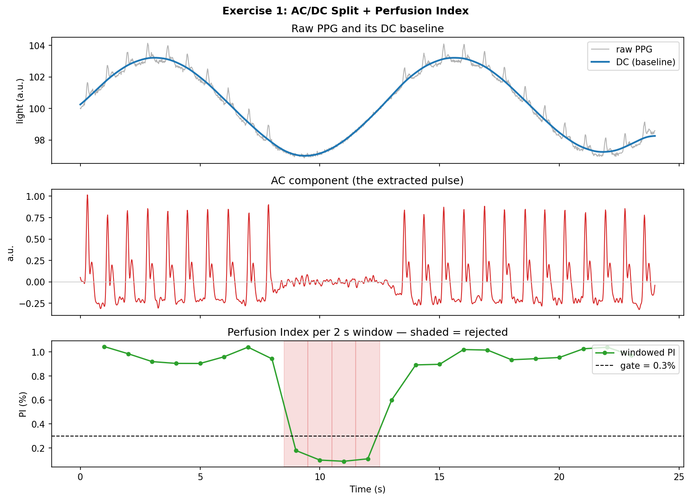
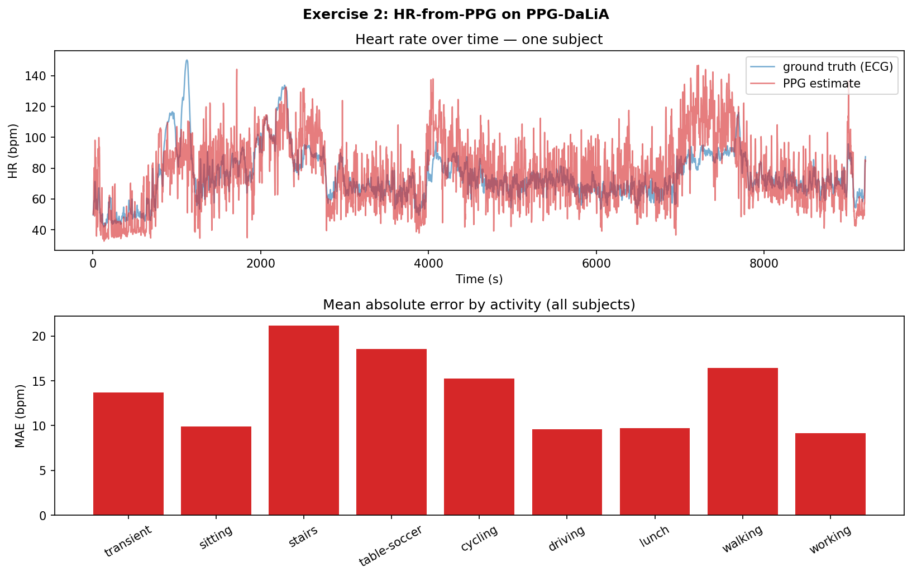

# PPG: Physiology & Pulse Analysis

> Photoplethysmography from the signal up — splitting the pulse from the
> baseline, gating bad windows, and turning a wrist PPG into a heart rate.

Part of [**DSP for Wearable Health Signals**](../README.md). *Exercises 3–4 in progress.*

A PPG is a big, slow **DC** light level with a tiny pulsatile **AC** ripple on
top — the extra light absorbed each heartbeat. These exercises work that signal
from first principles toward a real, scored heart-rate estimate.

---

## Contents

| # | Script | What it does |
|---|--------|--------------|
| 1 | [`exercise1_ac_dc_pi.py`](exercise1_ac_dc_pi.py) | Split PPG into AC (pulse) / DC (baseline), compute the **Perfusion Index**, and gate low-quality windows below ~0.3 % — the signal-quality check a watch runs before reporting a heart rate. *(synthetic)* |
| 2 | [`exercise2_hr_pipeline.py`](exercise2_hr_pipeline.py) | Full **heart-rate-from-PPG** pipeline scored on **PPG-DaLiA**, with the error broken out **by activity** — exposing how motion wrecks a wrist HR estimate. *(real data)* |
| 3 | _planned_ | HRV features from a tachogram. |
| 4 | _planned_ | SpO₂ via ratio-of-ratios. |

The synthetic-PPG generator, the PPG-DaLiA loader, and the figure helper live in
[`utils.py`](utils.py).

---

## How to Run

Dependencies are shared at the repo root — see the [top-level README](../README.md#setup).

```bash
# Exercise 1 — self-contained, runs anywhere
python exercise1_ac_dc_pi.py

# Exercise 2 — needs the real PPG-DaLiA dataset (UCI ML Repository, ~3 GB).
# Download, unzip, and point the script at the PPG_FieldStudy folder:
python exercise2_hr_pipeline.py --data-dir /path/to/PPG_FieldStudy
# or one subject:  --subject S3      (or set $PPG_DALIA_DIR)
```

The ~19 GB of unpacked PPG-DaLiA pickles are **not** committed — they're external
data and live outside the repo.

---

## Walkthrough

### 1 — AC/DC Split + Perfusion Index



Two zero-phase filters separate the signal: a heavy low-pass (< 0.4 Hz) recovers
the **DC** baseline (top), and a 0.5–8 Hz band-pass recovers the **AC** pulse
(middle). The **Perfusion Index** is the pulse size relative to the baseline,

```
PI = 100 × (p95(AC) − p5(AC)) / mean(DC)   [%]
```

— percentiles rather than min/max so a single motion spike can't inflate it.
Computed in a sliding 2 s window (bottom), PI collapses when the modelled sensor
lifts off the skin (8–13 s); windows below the **0.3 % gate** are shaded and
rejected. That gate is why a watch shows "—" instead of a confidently wrong
number: when the pulse is too weak to trust, you refuse to report.

### 2 — HR-from-PPG on PPG-DaLiA, stratified by activity



The pipeline is the standard recipe:

```
band-pass 0.5–4 Hz → peak detection (0.3 s refractory + prominence floor)
   → inter-beat intervals → instantaneous HR → reject impossible beats → median
```

[PPG-DaLiA](https://archive.ics.uci.edu/dataset/495/ppg+dalia) records a wrist
PPG (64 Hz) alongside an ECG-derived ground-truth HR, while 15 subjects sit,
walk, cycle, climb stairs, drive, and so on. Estimates are scored on the
dataset's own **8 s / 2 s window grid** so each one aligns with a ground-truth
label, and every window is tagged with its majority activity.

The point isn't one average number — it's the **activity-stratified** error,
because that's where the story lives (all 15 subjects, 64,695 windows):

| activity | MAE (bpm) |
|----------|----------:|
| working  | 9.19 |
| driving  | 9.58 |
| lunch    | 9.72 |
| sitting  | 9.92 |
| transient| 13.68 |
| cycling  | 15.26 |
| walking  | 16.46 |
| table-soccer | 18.53 |
| **stairs** | **21.19** |
| **overall** | **12.40** |

Stationary activities sit around **9–10 bpm**; motion roughly **doubles** the
error (stairs 21, table-soccer 19, walking 16). The cause is physical: arm-swing
**cadence** lands inside the cardiac band, and the peak detector locks onto
footsteps instead of heartbeats. No peak-picking trick separates them — that
takes an accelerometer reference and adaptive cancellation, which is exactly the
next project.

---

## Notes

- **Exercise 1** uses a synthetic PPG so the perfusion drop-out has known timing;
  **Exercise 2** uses the real PPG-DaLiA dataset only (no synthetic fallback).
- The 12.4 bpm overall MAE is a deliberately **naive** baseline — published
  PPG-DaLiA results reach ~7–8 bpm with frequency-domain tracking and motion
  compensation. The goal here is to expose the motion problem honestly, not to
  beat the benchmark (yet).
- The HR timeline in the figure is one subject; the MAE bars aggregate all 15.
