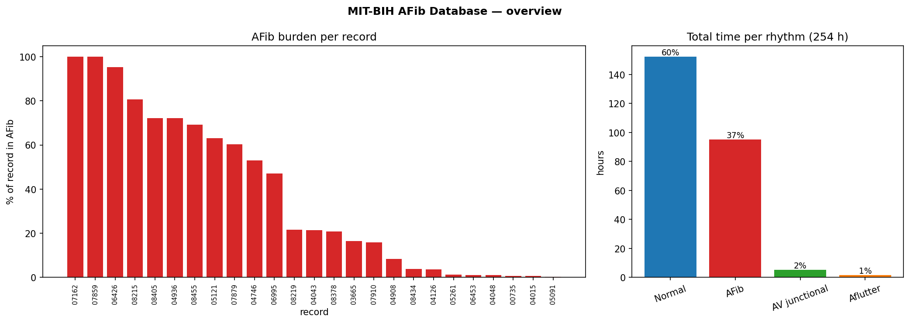
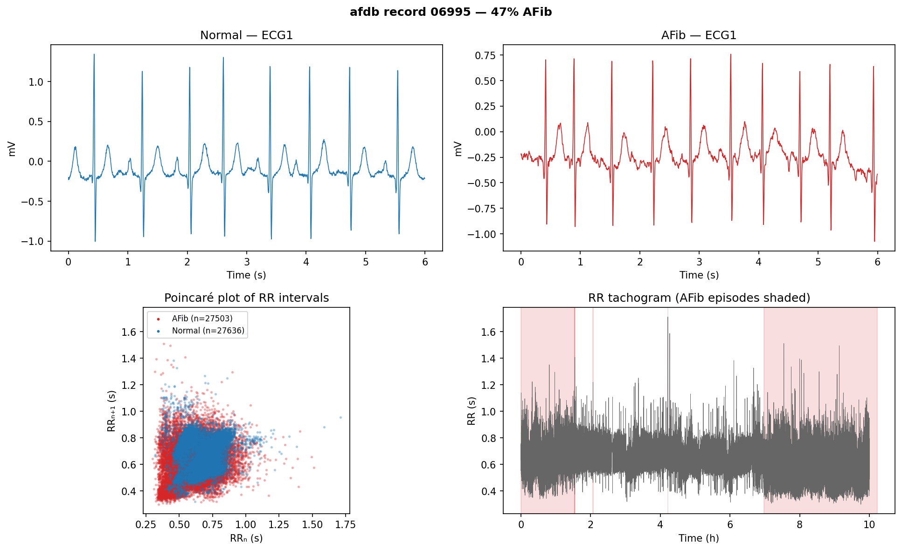

# Project 1 — AFib Detection

> Finding atrial fibrillation in long ECG recordings. **This stage: data
> exploration** — knowing the dataset cold before building a detector.

Part of [**DSP for Wearable Health Signals**](../README.md).

Data: the [**MIT-BIH Atrial Fibrillation Database**](https://physionet.org/content/afdb/)
(`afdb`) — 25 recordings, two ECG channels, 250 Hz, ~10 hours each, with
cardiologist rhythm labels. Pulled on demand via `wfdb`; nothing is committed.

---

## How much AFib, and where?



254 hours of ECG. **~37 % is AFib** — a lot for a clinical dataset, but spread
very unevenly: some records are 100 % AFib, others barely 1 % (left). AFib is
**paroxysmal** — it comes and goes — so any detector has to work *within* a
record, not just label whole records. That per-episode imbalance is the first
thing to design around.

## What does AFib look like?



Two tells, both visible above:

- **Morphology** — normal beats have an orderly P-wave before each QRS; in AFib
  (top right) the P-waves are replaced by a fibrillating baseline.
- **Rhythm** — AFib is *irregularly irregular*. The **Poincaré plot** (RRₙ vs
  RRₙ₊₁) makes it unmistakable: normal rhythm is a tight cluster on the diagonal,
  AFib is a diffuse cloud. The RR tachogram (bottom right) shows that scatter
  switching on and off exactly inside the shaded AFib episodes.

That RR irregularity — not the waveform — is the feature most AFib detectors
lean on, and it's why the next stage starts from beat intervals.

---

## Run it

```bash
# uses wfdb (present in the `ct-view` conda env — see ../CLAUDE.md)
python overview.py                      # scans all 25 records' rhythm labels
python explore_record.py --record 06995 # one record → strips + Poincaré + tachogram
```

Swap in any record to explore it yourself — a mostly-normal one (`04015`,
0.6 % AFib) shows an almost pure cluster; a high-burden one
(`07162`, 100 %) is nearly all cloud:

```bash
python explore_record.py --record 04015
python explore_record.py --record 07162 --channel 1
```

`utils.py` holds the small, readable `wfdb` wrappers (rhythm spans, beats,
partial signal reads) that both scripts share.
